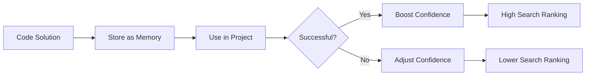

# Confidence & Decay System - MCP Memento

## Overview

The **Confidence & Decay System** is an intelligent knowledge quality management system that replaces complex bi-temporal tracking with a simple, automated approach. The system maintains memory accuracy over time by applying automatic decay to the confidence (trust) of relationships between memories.

## Problem Solved

**Problem**: Knowledge becomes obsolete over time, but traditional memory systems lack mechanisms to:
- Signal when knowledge is likely outdated
- Automatically reduce relevance of unused information
- Protect critical information from decay
- Order search results by reliability

**Solution**: A confidence system that:
- Tracks how reliable each relationship between memories is
- Applies intelligent decay based on time and memory type
- Boosts confidence when knowledge is validated
- Orders search results by `(confidence × importance)`

## System Architecture

### Database Schema

```sql
-- Fields added to relationships table
confidence FLOAT DEFAULT 0.8,           -- Trust level (0.0-1.0)
last_accessed TIMESTAMP DEFAULT CURRENT_TIMESTAMP,  -- Last usage
access_count INTEGER DEFAULT 0,         -- Number of accesses
decay_factor FLOAT DEFAULT 0.95,        -- Monthly decay rate (0.0-1.0)

-- Existing bi-temporal fields (maintained for compatibility)
valid_from TIMESTAMP NOT NULL DEFAULT CURRENT_TIMESTAMP,
valid_until TIMESTAMP,
recorded_at TIMESTAMP NOT NULL DEFAULT CURRENT_TIMESTAMP,
invalidated_by TEXT
```

### Confidence Ranges

| Confidence | Meaning | Action Required |
|------------|---------|-----------------|
| 0.9 - 1.0 | **High Confidence** | Recently validated, highly reliable |
| 0.7 - 0.89 | **Good Confidence** | Regularly used, generally reliable |
| 0.5 - 0.69 | **Moderate Confidence** | Somewhat outdated, consider review |
| 0.3 - 0.49 | **Low Confidence** | Likely outdated, review recommended |
| 0.0 - 0.29 | **Very Low Confidence** | Probably obsolete, consider deletion |

## Decay Mechanics

### Base Decay Formula

```
monthly_decay = confidence × decay_factor^(months_since_last_access)
```

Where:
- `decay_factor` = 0.95 (5% monthly decay by default)
- `months_since_last_access` = integer months since last usage

### Intelligent Decay Rules

The system applies different decay factors based on memory properties:

#### 1. Critical Memories - NO DECAY (decay_factor = 1.0)
Memories with these tags have **no decay**:
- `security`, `auth`, `api_key`, `password`, `critical`, `no_decay`

#### 2. High Importance Memories - Reduced Decay
```python
importance_factor = 1.0 - (importance × 0.3)
adjusted_decay = base_decay × importance_factor
```

Example:
- Importance = 0.9 → importance_factor = 0.73 → decay_factor ≈ 0.69 (31% less decay)
- Importance = 0.5 → importance_factor = 0.85 → decay_factor ≈ 0.81 (19% less decay)

#### 3. General Memories - Standard Decay
- Base decay: 5% per month (decay_factor = 0.95)
- Minimum confidence: 0.1 (won't decay below this)

#### 4. Temporary Context - Higher Decay
Memories with `temporary`, `session`, `debug` tags get faster decay.

### Decay Calculation Example

```python
# Memory with confidence 0.8, last accessed 3 months ago
base_decay = 0.95
months = 3
new_confidence = 0.8 × (0.95^3) ≈ 0.8 × 0.857 = 0.686

# Critical memory (no decay)
new_confidence = 0.8 × (1.0^3) = 0.8  # No change
```

## How Decay is Applied

The confidence decay system is applied automatically through multiple mechanisms:

### 1. Automatic On-Access Decay
- **When**: Every time a memory is accessed via `get_memento` or `recall_mementos`
- **How**: The system checks the last access time and applies appropriate decay
- **Efficiency**: Only decays relationships accessed during the current operation
- **Real-time**: Users see updated confidence scores immediately

### 2. Manual Decay Application
- **Tool**: `apply_memento_confidence_decay` MCP tool
- **When**: Can be triggered by:
  - Scheduled maintenance (cron jobs, scheduled tasks)
  - Manual intervention by developers
  - CI/CD pipeline steps
- **Batch Processing**: Applies decay to all relationships efficiently in SQL batches

### 3. Maintenance Script
For production deployments, we recommend setting up a monthly maintenance script:

```bash
#!/bin/bash
# monthly-decay-apply.sh
# Run via cron: 0 0 1 * * /path/to/monthly-decay-apply.sh

# Activate Python environment if needed
# source /path/to/venv/bin/activate

# Run decay application via MCP client (requires: pip install mcp)
python -c "
import asyncio, json
from mcp import ClientSession, StdioServerParameters
from mcp.client.stdio import stdio_client

async def apply_decay():
    params = StdioServerParameters(command='memento', args=['--profile', 'advanced'])
    async with stdio_client(params) as (read, write):
        async with ClientSession(read, write) as session:
            await session.initialize()
            result = await session.call_tool('apply_memento_confidence_decay', arguments={})
            data = json.loads(result.content[0].text)
            print(f'Decay applied: {data}')

asyncio.run(apply_decay())
"
```

### 4. Integration with CI/CD
```yaml
# .github/workflows/monthly-decay.yml
name: Monthly Confidence Decay
on:
  schedule:
    - cron: '0 0 1 * *'  # First day of every month at midnight
  workflow_dispatch:  # Allow manual trigger

jobs:
  apply-decay:
    runs-on: ubuntu-latest
    steps:
      - uses: actions/checkout@v4
      - uses: actions/setup-python@v5
        with:
          python-version: '3.11'
      
      - name: Install dependencies
        run: pip install -e ".[dev]"
      
      - name: Apply confidence decay
        run: |
          python -c "
          import asyncio, json
          from mcp import ClientSession, StdioServerParameters
          from mcp.client.stdio import stdio_client

          async def apply():
              params = StdioServerParameters(command='memento', args=['--profile', 'advanced'])
              async with stdio_client(params) as (read, write):
                  async with ClientSession(read, write) as session:
                      await session.initialize()
                      result = await session.call_tool('apply_memento_confidence_decay', arguments={})
                      data = json.loads(result.content[0].text)
                      print(f'Decay applied: {data}')

          asyncio.run(apply())
          "
```

### 5. Real-time vs Batch Processing
| Aspect | Real-time (On-Access) | Batch (Monthly) |
|--------|----------------------|-----------------|
| **Scope** | Only accessed memories | All memories |
| **Performance** | Minimal overhead | Higher resource usage |
| **Freshness** | Always up-to-date | May lag up to 1 month |
| **Use Case** | User-facing queries | Maintenance & cleanup |

### 6. Configuration Options
The decay behavior can be configured in `memento.yaml`:
```yaml
confidence:
  # Base monthly decay rate (default: 0.95 = 5% decay per month)
  base_monthly_decay: 0.95
  
  # Enable/disable automatic on-access decay
  enable_on_access_decay: true
  
  # Minimum confidence threshold (memories below this are flagged)
  minimum_confidence_threshold: 0.2
  
  # Protected memory types (no decay)
  protected_types:
    - security
    - auth
    - api_key
    - credential
```

### 7. Monitoring Decay Application
Check if decay is working properly:
```sql
-- Check average confidence over time
SELECT 
  strftime('%Y-%m', recorded_at) as month,
  COUNT(*) as relationships,
  AVG(confidence) as avg_confidence,
  MIN(confidence) as min_confidence,
  MAX(confidence) as max_confidence
FROM relationships 
GROUP BY strftime('%Y-%m', recorded_at)
ORDER BY month DESC
LIMIT 12;
```

The system is designed to be **self-maintaining** - regular use automatically keeps confidence scores updated, while batch processing ensures comprehensive coverage.

## Confidence Boosting

### Automatic Boost on Usage
Every time a relationship is accessed:
1. `access_count` increments by 1
2. `last_accessed` updates to current time
3. `confidence` increases by 0.01 (capped at 1.0)

### Manual Boosting
When knowledge is successfully validated:
- Use `boost_memento_confidence` tool
- Typical boost: +0.1 to +0.3
- Requires reason for the boost

### Boost Formula
```python
new_confidence = min(1.0, current_confidence + boost_amount)
```

## MCP Tools for Confidence Management

### 1. `adjust_memento_confidence`
**Purpose**: Manual confidence adjustment
**When to use**: When you know a relationship's accuracy has changed
```json
{
  "relationship_id": "rel-123",
  "new_confidence": 0.9,
  "reason": "Verified in production"
}
```

### 2. `get_low_confidence_mementos`
**Purpose**: Find obsolete knowledge
**When to use**: Periodic cleanup or when search results seem unreliable
```json
{
  "threshold": 0.3,
  "limit": 20
}
```

### 3. `apply_memento_confidence_decay`
**Purpose**: Apply automatic decay
**When to use**: Monthly maintenance or after long periods of inactivity
```json
{
  "memory_id": "mem-456"  # Optional: apply only to specific memory
}
```

### 4. `boost_memento_confidence`
**Purpose**: Boost confidence after successful usage
**When to use**: After implementing a solution or validating knowledge
```json
{
  "memory_id": "mem-456",
  "boost_amount": 0.2,
  "reason": "Successfully implemented in project X"
}
```

### 5. `set_memento_decay_factor`
**Purpose**: Set custom decay rates
**When to use**: For special memory types requiring different decay
```json
{
  "memory_id": "mem-789",
  "decay_factor": 0.98,  # 2% monthly decay
  "reason": "Important reference material"
}
```

## Search Result Ordering

### Default Ordering Formula
Search results are ordered by:
```
score = confidence × importance
```

### Why This Works
- **High confidence, high importance**: Top priority (reliable and important)
- **High confidence, low importance**: Still shown (reliable but less critical)
- **Low confidence, high importance**: Deprioritized (important but possibly outdated)
- **Low confidence, low importance**: Bottom of results

### Automatic Warnings
Results with confidence < 0.3 include warnings:
```
⚠️ Low Confidence (0.25): This information may be outdated
```

## Maintenance Routines

### Monthly Maintenance Script
```python
# 1. Apply decay to all relationships
apply_memento_confidence_decay()

# 2. Find low confidence memories
low_conf = get_low_confidence_mementos(threshold=0.3)

# 3. Review or delete obsolete knowledge
for memory in low_conf:
    if should_delete(memory):
        delete_memento(memory.id)
    else:
        # Flag for human review
        flag_for_review(memory)
```

### Integration with Workflows
1. **Code Review**: Boost confidence of solutions that pass review
2. **Production Validation**: Boost confidence of patterns used successfully
3. **Documentation Updates**: Adjust confidence when documentation changes
4. **Technology Migration**: Reduce confidence of deprecated technologies

## Configuration Examples

### YAML Configuration
```yaml
confidence_system:
  # Base decay rate (5% per month)
  base_decay_factor: 0.95
  
  # Minimum confidence before warning
  warning_threshold: 0.3
  
  # Critical tags that get no decay
  no_decay_tags:
    - security
    - auth
    - api_key
    - password
    - critical
    
  # Boost amounts
  usage_boost: 0.01
  validation_boost: 0.1
  manual_boost_range: [0.0, 0.5]
```

### Environment Variables
```bash
# Confidence system uses built-in defaults
# No environment variables required for confidence configuration
```

## Best Practices

### 1. Tagging for Intelligent Decay
```python
# Critical - no decay
tags = ["security", "api_key", "production"]

# Important - reduced decay  
tags = ["architecture", "design_pattern", "core"]

# Temporary - faster decay
tags = ["debug", "temporary", "experimental"]
```

### 2. Regular Maintenance
- **Weekly**: Check low confidence memories
- **Monthly**: Apply system-wide decay
- **Quarterly**: Review critical memories
- **Annually**: Comprehensive confidence audit

### 3. Confidence Lifecycle
```
Creation → Initial Use → Regular Use → Infrequent Use → Review → Update/Delete
   0.8         0.85         0.9          0.7             0.4       0.9/0.0
```

### 4. Integration with Development Workflow


## Performance Considerations

### Indexing Strategy
```sql
-- Essential indexes for performance
CREATE INDEX idx_relationships_confidence ON relationships(confidence);
CREATE INDEX idx_relationships_last_accessed ON relationships(last_accessed);
CREATE INDEX idx_relationships_current ON relationships(valid_until) WHERE valid_until IS NULL;
```

### Batch Operations
- Decay applied in SQL batches, not per-relationship
- Changes counted with `SELECT changes()`
- Transaction-safe with rollback on error

### Memory Usage
- Confidence fields add ~32 bytes per relationship
- Decay calculation uses efficient date math
- Search ordering adds minimal query overhead

## Migration from Bi-Temporal Tracking

### Why Confidence System is Better

| Aspect | Bi-Temporal Tracking | Confidence System |
|--------|---------------------|-------------------|
| **Complexity** | High (dual timelines) | Low (single score) |
| **Maintenance** | Manual invalidation | Automatic decay |
| **LLM Understanding** | Confusing | Intuitive |
| **Search Relevance** | Binary (valid/invalid) | Gradual (0.0-1.0) |
| **Human Action Required** | Frequent | Minimal |

### Migration Path
1. **Phase 1**: Add confidence fields alongside bi-temporal
2. **Phase 2**: Use confidence for search ordering
3. **Phase 3**: Apply automatic decay
4. **Phase 4**: Deprecate manual bi-temporal updates

## Troubleshooting

### Common Issues

#### 1. Confidence Not Decaying
- Check if memory has critical tags (no decay)
- Verify `last_accessed` timestamp is updating
- Ensure decay job is running

#### 2. Search Results Seem Wrong
- Check confidence scores: `SELECT confidence FROM relationships`
- Verify ordering formula: `confidence × importance`
- Look for low confidence warnings

#### 3. Performance Issues
- Check indexes on confidence and last_accessed
- Monitor decay job duration
- Consider batch size adjustments

### Debug Queries
```sql
-- Check confidence distribution
SELECT 
    CASE 
        WHEN confidence >= 0.9 THEN 'High'
        WHEN confidence >= 0.7 THEN 'Good'
        WHEN confidence >= 0.5 THEN 'Moderate'
        WHEN confidence >= 0.3 THEN 'Low'
        ELSE 'Very Low'
    END as confidence_level,
    COUNT(*) as count
FROM relationships
WHERE valid_until IS NULL
GROUP BY confidence_level
ORDER BY confidence DESC;

-- Find memories needing review
SELECT r.id, m.title, r.confidence, r.last_accessed
FROM relationships r
JOIN nodes m ON r.from_id = m.id OR r.to_id = m.id
WHERE r.confidence < 0.3
  AND r.valid_until IS NULL
ORDER BY r.confidence ASC
LIMIT 10;
```

## Future Enhancements

### Planned Features
1. **Machine Learning**: Predict obsolescence based on usage patterns
2. **Confidence Dashboard**: Visual representation of system health
3. **Alert System**: Notifications for critically low confidence
4. **Cross-System Sync**: Share confidence scores between systems
5. **Temporal Analysis**: Confidence trends over time

### Research Areas
- Optimal decay rates for different domains
- Confidence propagation in relationship graphs
- Automated confidence adjustment based on external signals
- Integration with version control systems

## Conclusion

The Confidence & Decay System transforms MCP Memento from a passive memory store into an **intelligent knowledge management system** that:

1. **Maintains Accuracy**: Automatically reduces confidence of unused knowledge
2. **Protects Critical Info**: No decay for security/auth/api_key memories
3. **Improves Search**: Orders results by reliability and importance
4. **Reduces Maintenance**: Automatic decay vs manual bi-temporal updates
5. **LLM-Friendly**: Simple confidence concept instead of complex timelines

By implementing this system, you ensure that your AI assistants work with the most reliable, up-to-date knowledge while automatically flagging potentially obsolete information for review.
